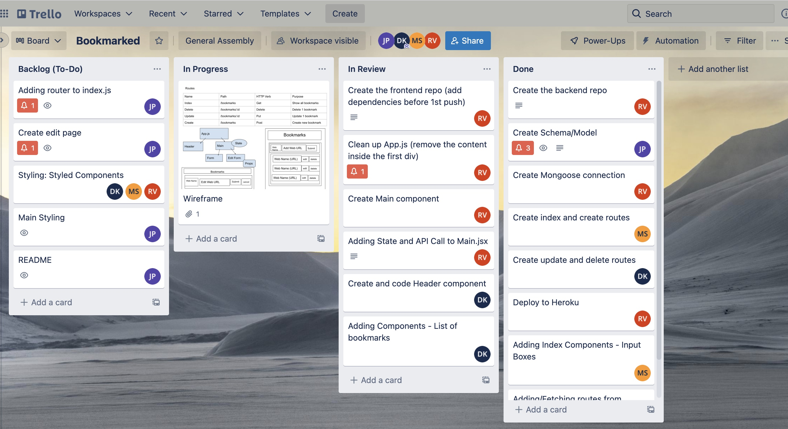
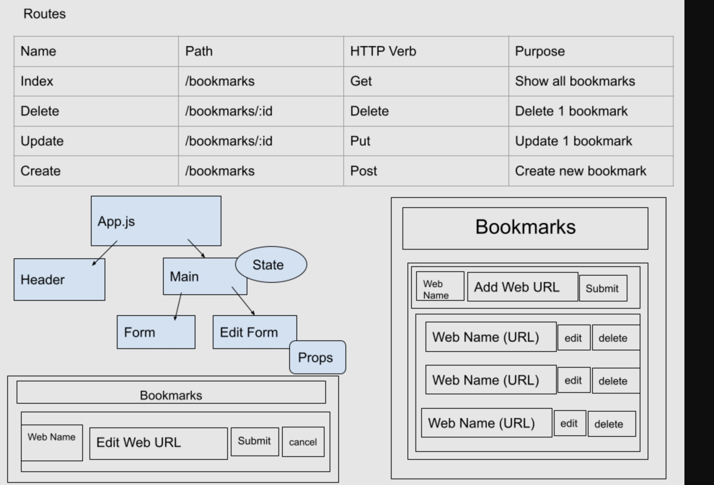

## Vanilla Ice

- Frontend repo

# Product Requirements Documentation

**Summary**

| Field | Detail |
|--------|-----|
| Project Name | Vanillaice|
| Description | A website where users can store their favorite websites in a bookmark.|
| Developers | Jonathan Pierre, Deanna Keys, Ramon Velarde, Madhumida Sanjeeviraj |
| Live Website Frontend | https://main--soft-melomakarona-875d4b.netlify.app/ |
| Live Website Backend | https://vanilla-ice-bookmark-backend.herokuapp.com/ |
| Repo Frontend| https://github.com/Rvelarde83/vanillaice-frontend |
| Repo Backend|  git@github.com:Rvelarde83/vanillaice-backend.git |
| Trello Board |https://trello.com/b/FOxZvnkq/bookmarks |

## Technologies Used
- HTML5                  
- CSS3                   
- JavaScript             
- JQuery
- Express
- Node
- React 

## Problem Being Solved and Target Market
Users can now store their bookmarks on this site

## User Stories
- Users should be able to do CRUD Operations with the bookmarks 
- Users should be able to navigate to an edit page for a specific bookmark
- Users should be able to see all bookmarks on the site

## Screenshots

## Future Enhancements
- User Authentication
- Stored cookies and sessions
- Mobile Friendly
